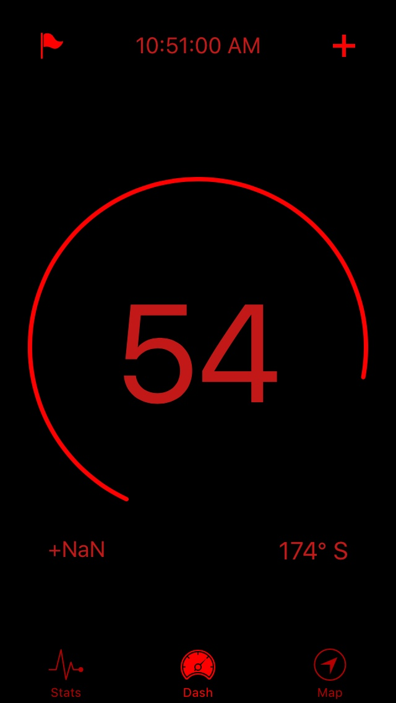
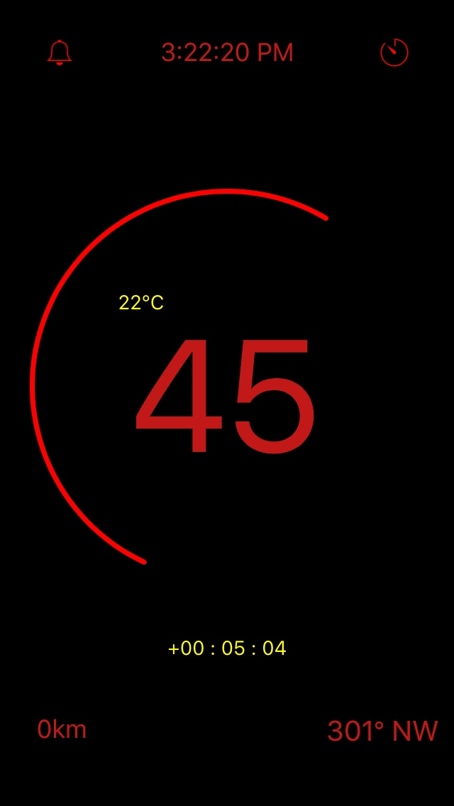

# Gauge
Very simple speed guage app for bikers. 

Currently, this app is for iphone only, since it is more tideous to develop for android phones (So many of them out there). 
If anyone is willing to help that would be great too. I did this as a project, since I love biking (cycling). 

Created with ionic framework. Still adding more features. 
They are a few bugs so fill free to give a hand you would like. 
I have managed to use many api that are javascript based. 
Therefore it should be easy to add new features since ionic framework is pretty flexible. 

Current bugs:
  High CPU usage,  
  Speed display issue (sometimes it shows some times it doesn't)

API's used: 

  Google angular js maps, 
  Cordova Gps, 
  Moment js library, 
  Cordova motion sensor

  
Pro version
   
Basic version

# Gauge
